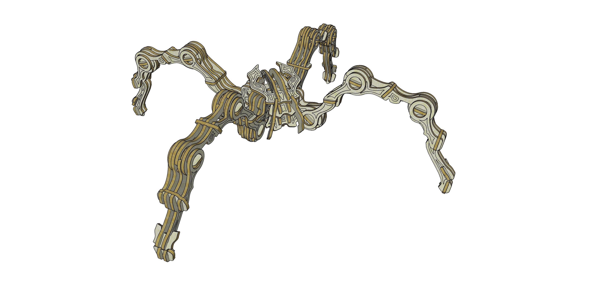

# OBUG

A small articulated model built as a test of a new joint system.

More information and additional images:  
https://obuqdesign.wordpress.com/2022/09/04/obug/

## Details

| Property | Value |
|---|---|
| Type | Tridimensional model (125 pieces) |
| Designed for | 3mm mdf or plywood |
| Dimensions | Height: 65mm; Lenght: 580mm; Width: 580mm |
| Design file format | DXF R14 |
| Units | mm |
| Nº of laser-cut files | x3 (ReadyToCut layout) |
| Frame | 250x300mm (ReadyToCut layout) |
| Scalable | Yes (limited) |

---

If you like this design and would like to support my work:  
https://buymeacoffee.com/obuq
